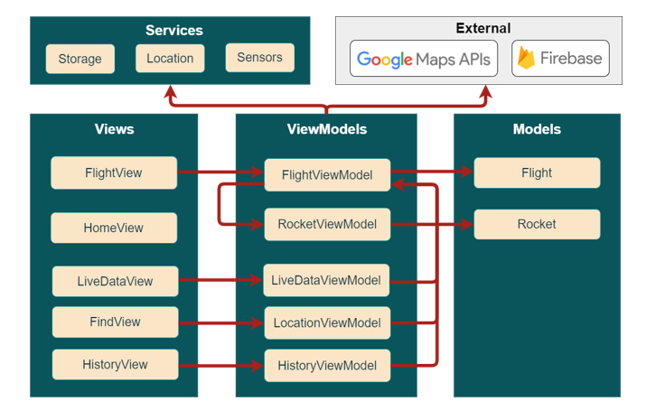

# Roc Flight

A flight computer and ground station software as one application.

## What does it do ?
The basic idea is a mobile app with two main modes : Rocket and Launcher (Ground station)

### Rocket mode 
This mode is for placing the cellphone in your rocket (yes, i know, but it's fine don't worry). The app then shows a code that the launcher can use on another phone to connect to the rocket.
The app on rocket can :
- Register data from various sensors (Accelerometer, temperature, barometer)
- Register its GPS location
- Send selected data to a database in real-time
- Locally save data
### Launcher mode
This mode is for the cellphone monitoring the flight (much safer). You first need to enter the rocket code from the other phone, than you can use the various modules, such as :
- View all data from the connected rocket
- View graphics from important data (accelerometer, altitude)
- View detected apogee of the flight
- View the position (coordinates) of the rocket in a map, updating in real-time
- View the flight history associated with the cellphone
## Architecture

## Post first flight : 
- Slow flight detection. Might need to add a button for faster sampling on demand
- Needs faster sampling in flight
- Sampling at 5 sec after apogee not landing
- Vertical velocity data is good but not transposed correctly
- Would need to save up data and send multiple packets to server
- Acceleration is a little weird as well.
- Save data in phone as csv
- Export flight as csv
- Distance in GPS mode weird
- phone going to sleep. Need to figure out how to run in background !!!!!!
- Velocity very weird